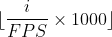

# Data Quality Report - ISL data

**Directories for ISL:** 

IrishSignLanguage \(15 GB\)

1. 101 \- FAMILY \(343 MB\)
2. 102 \(206 MB\)
3. EAF files \(40 MB\)
4. EAF Files for Ferarra et al project 2020 \(7.1 MB\)
5. Frog Story \(718 MB\)
6. Personal Stories \(974 MB\)
7. SciencesVocab \(2.2 GB\)
8. Sign Linguistics Videos for IDS 2020 \(1.6 GB\)
9. Volterra Task \(8.7 GB\)

**File formats**

* **Video**
    * FLV \(Flash video\)
    * MP4 \(
    * DV \(Digital video\)
    * MOV \(Mac Quicktime video format\)
* **Annotations**
    * EAF \(
    * PFSX \(Human readable ELAN document files \- preference metadata file\)
    * PFS \(Binary ELAN document files \- preference metadata file\)
    * XLSX \(Excel spreadsheet\)

**Directory Descriptions**

1. **101 \- FAMILY¬** 
    * **sub\-directories**
        + flv (206 MP4 files)
        + mp4 (187 MP4 files)


2. **102**
    * **sub\-directories**
        + flv (224 FLV files)
        + mp4 (107 MP4 files)

3. **EAF files** 
    * **sub\-directory**
        + Word Class EAFs \(Susanne Militzer\) 02 02 2010
            - 12 EAF files
            - 5 PFSX files

    * 62 EAF files
    * 38 eaf.001 files
    * 61 PFSX files
    * 3 PFS files

4. **EAF Files for Ferarra et al project 2020** 
    * 16 PFSX files
    * 14 EAF files

5. **Frog Story** 
    * 21 MOV files
    * 1 XLSX file \(containing metadata\)

6. **Personal Stories** 
    * 37 MOV files

7. **SciencesVocab** 
    * **sub\-directory**
        +  Math 
            - 71 MOV files

8. **Sign Linguistics Videos for IDS 2020**
    * **sub\-directory**
        * EAF Files for Sign Linguistics for IDS videos
            + 71 MOV files

    * 21 MP4 files

9.  **Volterra Task**
    * 16 DV files

**EAF\_files \(Directory 3.\)**

**Relevant script: parse\_elan.py**
Arguments:
* --eaf\_root: Root directory of the SoI corpus EAF files.
* --video\_root: Root directory of the SoI corpus video files.
* --json\_out: Output JSON file of parsed results.
* --errors\_out: Output directory for the error.csv.

**Annotation alignment:** 

```
An example from: "11 - Frankie (Dublin) - Butterfly Statue (Final, 2nd).eaf" within the ELAN files. 
"Mouthing" annotation tier
|--------------------|-----------------------|---------------------|
| ms value for frame | annotation start time | annotation end time |
|--------------------|-----------------------|---------------------|
| 53160              | 53180                 | 53190               |
| 53200              | 53180                 | 53190               |
|--------------------|-----------------------|---------------------|
"Head Movement" annotation tier
|--------------------|-----------------------|---------------------|
| ms value for frame | annotation start time | annotation end time |
|--------------------|-----------------------|---------------------| 
| 48040              | 48050                 | 48070               |
| 48080              | 48050                 | 48070               |
|--------------------|-----------------------|---------------------|
|--------------------|-----------------------|---------------------|
| ms value for frame | annotation start time | annotation end time |
|--------------------|-----------------------|---------------------| 
| 57480              | 57490                 | 57500               |
| 57520              | 57490                 | 57500               |
|--------------------|-----------------------|---------------------|

We can see that, in this case, the millisecond timing of the frame is less than the annotation time window but then the next frame is greater than the annotation time window therefore the annotation is for a time period that "doesn't exist" given the framerate. This indicates that the annotation is misaligned. The number of instances of this type of misalignment will need to be noted. The missalignments for these can be collected with a dictionary:
{'Translation': [],
 'Notes': [],
 'Lexical Gloss': [],
 'Mouthing': [(53180, 53190, 'want')],
 'Dominant Hand': [],
 'Non-Dominant': [],
 'Eyebrows': [],
 'Eye Aperture': [],
 'Eyegaze': [],
 'Cheeks': [],
 'Head Movement': [(48050, 48070, 'TILT+forward'), (57490, 57500, '')],
 'Body Movement': [],
 'Iconic Info': [],
 'Point of view': [],
 'Point of View': [],
 'Discourse Markers': [],
 'Body Partitioning': [],
 'BP & Discourse Marking': []}

```

The following discussion is worth a review to check for correctness: 

Each frame was assigned a millisecond value using the following formula:


where i is the frame number \(1\<= i \<=number of frames in video\), FPS is the frames per second. Intuitively, the frame index \(i.e. frame number\)/ frames per second = fraction of a second that the current frame is at. Obviously 1000 = number of milliseconds per second so multiplying by 1000 tells us at what millisecond the frame is at. An annotation was said to correspond to a given frame if:

* The ms value was greater than or equal to the ms value of the start time of the annotation. 
* The ms value was less than or equal to the ms value of the end time of the annotation. 
* The end time was greater than or equal to the last frame in the video  \(i.e. the annotation does not go beyond the end of the video\). 

**Video files:** 

A note was taken of all non\-existent or corrupted files \(i.e. video paths that fail to load\) was taken. There appears to only be one file with this issue in Personal Stories: 

```
IrishSignLanguage/Personal Stories/01 - Personal - Senan (Dublin) copy.mov
```

The video format in the annotations actually doesn't match the actual format as data has been converted in some cases. For instance, in "Personal Stories", videos seem to have been converted from MPG to MOV. For example 

```
SignON/IrishSignLanguage/Personal stories/31 - Personal - Catherine (Cork).mpg
```

is actually at the following path

```
SignON/IrishSignLanguage/Personal stories/31 - Personal - Catherine (Cork) (Converted).mov
```

Therefore, in the case where the file path for a given file does not exist, the loading script checks for the "converted" version \(i.e. with "... \(Converted\).mov" instead of "...mpg"\). The directory name "Personal Stories" also had to be corrected from "Personal stories" \(i.e. 's' of stories was not capitalised in old file path\).  This solved most of the "file not found" errors. In some cases it is clear, through manual inspection, that the files legitimately were not in the ISL directory. A note of these is taken for future reference. 

Some annotation files do not have "RELATIVE\_MEDIA\_URL" field in their EAF file, so "MEDIA\_URL" is used instead as all annotation files seem to have this. 

Each EAF file was written to a JSON file using the **parse\_elan.py** and outputs two files:

1. **annotations.json**
    * **"relative\_video\_path"**
    * **"video\_format"**
    * **"annotations"**
    * **"misaligned\_annotations"**
2. **errors.csv:** 

**Data loading** 

**Relevant script: write\_frames.py**
Arguments:
* --video\_root: Root directory of the SoI corpus video files.
* --anno\_json: Output JSON file from the parse_elan.py step.
* --clean\_dir: Output directory for the cleaned data. 

It is noteworthy that each frame is potentially associated with multiple tiers of labels. Moreover, these labels may not necessarily start and end at the same times. This makes segmenting the video according the their corresponding label not possible. Instead, it would make more sense to associate each frame of the video with a corresponding timestamp. A sliding window approach could then theoretically be employed in order to segment frames. 

To simplify the data loading process, each frame is saved as an image. To do this, the video file is used as the directory name for the directory containing all the frames of that video file. The frame number that is associated with that frame is appended to the end of the original filename for each frame. for example, "Personal Stories/03 \- Personal \- Noeleen \(Dublin\) \(Converted\).mov" is saved as follows: 

**data\_clean** 
```
Personal Stories
  |-----> 03 - Personal - Noeleen (Dublin) (Converted)
        |-----> 03 - Personal - Noeleen (Dublin) (Converted)_frame_0.jpg
                                        .
                                        .
                                        .

        |----->03 - Personal - Noeleen (Dublin) (Converted)_frame_2295.jpg
```
The labels associated with each tier of annotations for each frame is saved in a CSV with the title of the source video file. So for the example above, the annotations  would be in the following directory:

**data\_clean/Personal Stories/03 \- Personal \- Noeleen \(Dublin\) \(Converted\)/03 \- Personal \- Noeleen \(Dublin\) \(Converted\)\_labels.csv**

* If a given label is not present in a frame, it is assigned a value of "Nan". 
* the millisecond value for each frame is calculated by the frame index i \(starting from zero\)
* A label is give to frames at millisecond values from and including the start time in the annotation up to and including the end time \(whether or not to include the end time may be a subject of debate\).

**prep\_data.py**
This step will clean the data i.e. gather corrected start and end ms timestamps, discard duplicate/error EAF files, filter glosses and extract participant names.

Arguments:
* --anno\_json: Output JSON file from the parse_elan.py step.
* --csv\_out: Output CSV including columns video_name, fps, start\_ms, end\_ms, gloss, participant
* --errors\_out: Output JSON file of duplicate/error EAF files. 

**create\_dataset.py**
Creates a stratified split of the data and encodes interger labels. 

Arguments: 
* --csv\_in: Path to .csv output of prep\_data.py
* --csv\_out: Desired output/path/to/file.csv

**extract\_clips.py**
Extracts single sign clips from original videos and produces final samples.csv.

Arguments: 
* --data\_dir: Path to directory containing original videos.
* --csv\_in: Path to .csv output of create\_dataset.py.
* --out\_dir: Desired output path for resulting clips.
* --csv\_out: Desired output/path/to/file.csv.

**pose\_estimation.py**
Extracts pose estimation keypoints from clips resulting from extract\_clips.py.

Arguments:
* --clip: Path to clip we want to extract keypoints from.
* --out\_dir: Destired output path for resulting .npy file. 
